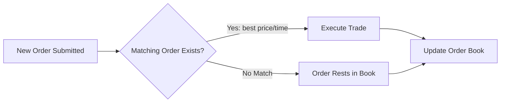

# Electronic Trading Platform — Matching Engine

A backend REST API simulating a stock exchange matching engine, implementing price-time priority order matching and real-time order-book aggregation.

## What This Does

When a buy or sell order comes in, the engine checks whether it can be matched against existing orders on the opposite side of the book. Orders are matched by **price-time priority**: the best price is matched first, and among orders at the same price, the earliest one submitted wins — the same rule real exchanges use. Unmatched orders rest in the order book until a matching order arrives.



## Tech Stack
Java 17 · Spring Boot 3 · Spring Data JPA · PostgreSQL · Maven · JUnit 5 · Mockito

## Key Architecture Decisions
- **Thread Safety:** Hibernate Optimistic Locking (`@Version`) prevents race conditions when multiple orders arrive and attempt to match at the same instant.
- **Data Isolation:** Strict DTO mappings prevent exposing PostgreSQL entities directly through the REST API layer.
- **Custom Queries:** JPA derived queries handle price-time priority sorting without hand-written SQL.

## API Endpoints

| Method | Endpoint | Description |
|---|---|---|
| POST | `/orders` | Submit a new buy/sell limit or market order |
| GET | `/orders/{id}` | Retrieve order details and status by ID |
| DELETE | `/orders/{id}` | Cancel an active resting order |
| GET | `/orders?userId={userId}` | List all orders placed by a specific user |
| GET | `/orderbook/{instrument}` | View current active bids and asks for an instrument |

## Example Request

```bash
curl -X POST http://localhost:8080/orders \
  -H "Content-Type: application/json" \
  -d '{
    "instrument": "AAPL",
    "side": "BUY",
    "quantity": 50,
    "price": 150,
    "type": "LIMIT"
  }'
```

## Running Locally
1. Create a database named `trading` in PostgreSQL.
2. Set your local PostgreSQL username/password in `src/main/resources/application.properties`.
3. Run: `./mvnw spring-boot:run` — server starts on `http://localhost:8080`, tables generate automatically.

## Testing

```bash
./mvnw test
```
**Coverage:** 10 tests total (6 unit tests, 4 integration tests) covering core matching logic, perfect limit matches, market orders, REST DTO validation, and optimistic locking concurrency exceptions.

## Known Limitations / Next Steps
- **WebSockets:** Add real-time push updates for the order book to support a live frontend UI.
- **Event-Driven Architecture:** Integrate Kafka to broadcast `TradeExecuted` events to downstream risk and clearing services.
- **Order Types:** Currently supports LIMIT and MARKET orders; plan to add STOP and STOP-LIMIT orders.
